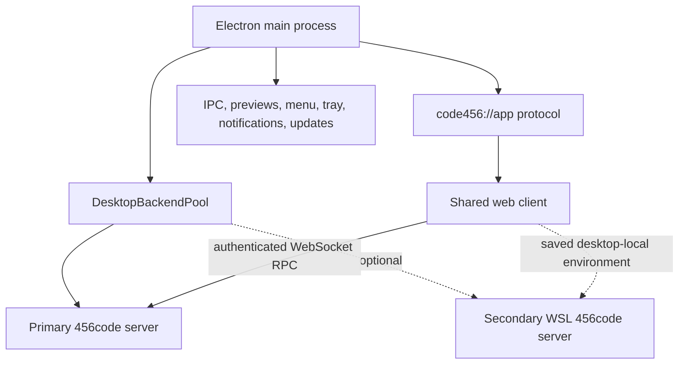

<!-- docs/architecture/desktop.md -->
<!-- describes desktop process, backend, renderer, and shutdown ownership -->

# Desktop Lifecycle

`apps/desktop` is the Electron host for the shared 456code web client. It does not implement a
second agent server. It supervises one or more instances of the same `apps/server` backend,
provides native capabilities through IPC, and owns the process and window lifecycle around those
instances.

## Process Topology

The pool always owns a primary backend instance. Normally that instance runs with Electron's Node
runtime on the host. In Windows WSL-only mode, the primary resolves to the selected WSL distro. In
dual mode, the Windows primary remains available while `DesktopWslBackend` registers a separate
WSL instance; the renderer discovers that secondary backend through the same saved-environment
connection path used for remote environments.

Each pool entry is a separate `DesktopBackendInstance` with its own state, mutex, child scope,
restart loop, process identifier, readiness state, and output log. The pool refuses duplicate
instance identifiers and owns the lifetime of every registered child scope.

## Startup Sequence

1. The desktop runtime installs its shell environment, resolves the application data directory,
   loads persisted settings, configures native identity and lifecycle listeners, and waits for
   Electron readiness.
2. Bootstrap selects the backend port and exposure mode, creates local-environment credentials,
   and derives the primary backend launch configuration.
3. Electron registers `code456://app` in packaged builds (`code456-dev://app` in development) as a
   standard secure origin. The protocol proxies the shared web client while applying the desktop
   content-security policy.
4. IPC handlers are installed before the primary backend starts. WSL-only mode may show a bounded
   connecting splash while its backend cold-boots.
5. The backend receives a schema-validated bootstrap envelope over a dedicated file descriptor on
   the native path or standard input through `wsl.exe`. The desktop waits for
   `/.well-known/t3/environment` before marking that instance ready.
6. Primary readiness opens the main window. The window always loads the desktop protocol URL; the
   shared connection runtime connects it to the ready backend.
7. When enabled, the WSL reconciler registers and starts a secondary instance without blocking
   primary readiness.

Development requires an explicit `T3CODE_PORT`. Packaged startup scans from port 3773 until it finds
a port available on the supported loopback and wildcard bind addresses.

## Renderer and Native Boundary

The main renderer uses context isolation, a sandboxed preload, and no Node integration. The preload
exposes the typed desktop bridge used for settings, environment management, native dialogs,
updates, menus, and the in-app preview browser. Preview guests have separate partitions and are
validated before attachment; they do not inherit the main renderer's trust boundary.

The desktop protocol keeps the renderer on a stable secure origin even though its upstream target
differs between development and packaged builds. External navigation goes through the native shell
allowlist instead of granting the renderer general process access.

## Architecture Resources

Architecture resources use the same authenticated Effect RPC connection as the rest of the shared
web client. Electron does not inject credentials into a separate architecture iframe or maintain an
architecture-specific request interceptor. Primary, WSL, and saved remote environments therefore
follow the connection runtime's normal authentication and environment-selection boundary; see
[Cartographer architecture analysis](../integrations/cartographer.md).

Impact Diff and Repository Map are owned by that shared web renderer. The desktop host does not
mount a parallel architecture UI, duplicate graph state, translate architecture resources, or own a
second presentation lifecycle. Desktop-specific verification therefore covers protocol, window,
renderer, and backend lifecycle behavior around the same web implementation.

## Failure and Restart Behavior

An unexpected backend exit clears readiness and schedules a restart with exponential delay from
500 milliseconds to 10 seconds. Readiness probes run for up to one minute with bounded request
timeouts. A stop request disables the restart loop before closing the active child, sends
`SIGTERM`, and allows a two-second grace period before forced termination.

WSL preflight distinguishes transient startup failures from fatal configuration failures.
Transient failures receive a bounded retry window. A failed WSL-only primary falls back to the
Windows backend for the launch; fatal configuration failures also persist the safe fallback when
possible. Secondary WSL registration and removal do not tear down the primary instance.

## Quit, Relaunch, and Updates

Electron quit, `SIGINT`, and `SIGTERM` converge on `DesktopShutdown`. Before allowing Electron to
exit, the lifecycle flushes main-window bounds, requests shutdown, and waits for the application
scope's finalizer to stop every registered backend concurrently. Relaunch uses the same shutdown
barrier; development exits with code 75 so its outer runner can restart it, while packaged builds
ask Electron to relaunch and then exit normally.

Desktop application updates are owned by `DesktopUpdates` and `electron-updater`. A backend that
advertises `desktop-managed` never self-installs a parallel server process; the user updates the
desktop application that owns it. See [Server Update Architecture](./server-updates.md).

## Source Map

- Startup composition: `apps/desktop/src/app/DesktopApp.ts`
- Quit and relaunch coordination: `apps/desktop/src/app/DesktopLifecycle.ts` and
  `apps/desktop/src/app/DesktopShutdown.ts`
- Backend configuration and supervision: `apps/desktop/src/backend/DesktopBackendConfiguration.ts`,
  `DesktopBackendManager.ts`, and `DesktopBackendPool.ts`
- Optional WSL lifecycle: `apps/desktop/src/wsl/DesktopWslBackend.ts`
- Renderer protocol: `apps/desktop/src/electron/ElectronProtocol.ts`
- Window readiness and creation: `apps/desktop/src/window/DesktopWindow.ts`
- Native bridge: `apps/desktop/src/preload.ts` and `apps/desktop/src/ipc/DesktopIpcHandlers.ts`
- Update state machine: `apps/desktop/src/updates/DesktopUpdates.ts`
