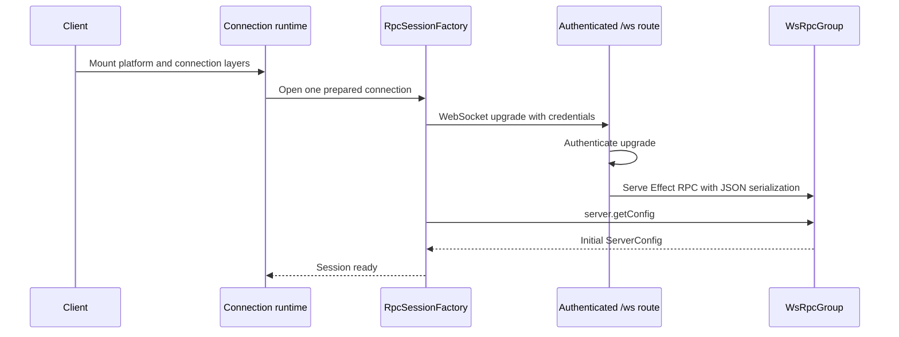
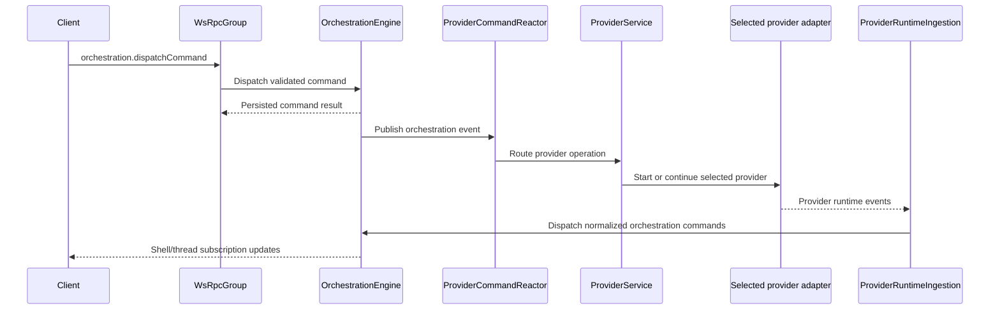
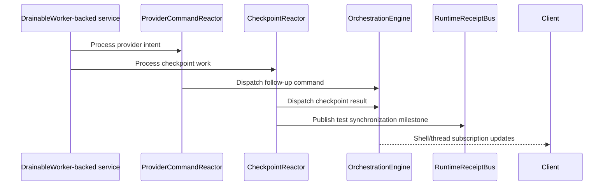

# Architecture

456code runs as a Node.js HTTP/WebSocket server, serves a React web app, and routes agent work
across the built-in Codex, Claude, Cursor, Grok, and OpenCode providers.

```
┌───────────────────────────────────────┐
│  Web or mobile client                 │
│  Shared connection runtime            │
│  RpcSessionFactory                    │
└────────────────┬──────────────────────┘
                 │ authenticated /ws
                 │ Effect RPC + JSON
┌────────────────▼──────────────────────┐
│  apps/server                          │
│  WsRpcGroup                           │
│  OrchestrationEngine                  │
│  ProviderService + adapter registry   │
│  Queue-backed reactors                │
└────────────────┬──────────────────────┘
                 │ provider-native protocols
┌────────────────▼──────────────────────┐
│  Built-in provider runtimes           │
│  Codex / Claude / Cursor / Grok /     │
│  OpenCode                             │
└───────────────────────────────────────┘
```

## Components

- **Client apps**: Web and mobile mount the shared connection runtime. The runtime owns endpoint
  preparation, authentication, WebSocket Effect RPC sessions, and retries; application components
  consume environment-scoped services and state.

- **Server**: `apps/server` serves the web app and exposes the authenticated `/ws` route. The route
  serves the shared [`WsRpcGroup`][1] with JSON serialization after authenticating the WebSocket
  upgrade.

- **Provider runtime**: [`ProviderService`][4] routes sessions through the provider adapter
  registry. The registered built-in drivers create the Codex, Claude, Cursor, Grok, and OpenCode
  implementations behind that shared service contract.

- **Background workers**: Long-running async flows such as runtime ingestion, command reaction,
  and checkpoint processing run as queue-backed workers. This keeps work ordered, reduces timing
  races, and gives tests a deterministic way to wait for the system to go idle.

- **Runtime receipts**: [`RuntimeReceiptBus`][8] defines checkpoint and turn-quiescence milestones
  for tests and harnesses. The production layer intentionally does not retain or broadcast these
  receipts.

- **Server updates**: A connected environment advertises whether its server can replace itself.
  When client and server versions differ, the browser selects an automatic, desktop-managed, or
  manual update path without changing connection ownership. See
  [Server Update Architecture](./server-updates.md).

## Event Lifecycle

### Startup and client connect



1. Web and mobile mount the shared connection layer at the application root.
2. The connection runtime prepares an endpoint and asks [`RpcSessionFactory`][2] for one session.
3. The server's [`/ws` route][3] authenticates the WebSocket upgrade before serving RPC calls.
4. Client and server use JSON serialization for the shared [`WsRpcGroup`][1].
5. The session becomes ready after the socket opens and `server.getConfig` succeeds.

### User turn flow



1. A user action becomes an `orchestration.dispatchCommand` Effect RPC call.
2. [`OrchestrationEngine`][6] validates the command, persists its events and command receipt, and
   updates projections.
3. [`ProviderCommandReactor`][7] reacts to provider intent and calls [`ProviderService`][4], which
   selects the configured provider adapter.
4. [`ProviderRuntimeIngestion`][5] converts provider-native runtime events into orchestration
   commands and events.
5. Streaming shell and thread RPCs deliver the resulting state to connected clients.

### Async completion flow



1. Work continues after the initial command result in [`ProviderRuntimeIngestion`][5],
   [`ProviderCommandReactor`][7], and [`CheckpointReactor`][9].
2. These flows use [`DrainableWorker`][10] and expose `drain()` for deterministic test
   synchronization.
3. `CheckpointReactor` publishes checkpoint and turn-quiescence milestones to
   [`RuntimeReceiptBus`][8]; only the test layer streams them.
4. User-visible changes are persisted through [`OrchestrationEngine`][6] and delivered through the
   Effect RPC subscription streams.

[1]: ../../packages/contracts/src/rpc.ts
[2]: ../../packages/client-runtime/src/rpc/session.ts
[3]: ../../apps/server/src/ws.ts
[4]: ../../apps/server/src/provider/Layers/ProviderService.ts
[5]: ../../apps/server/src/orchestration/Layers/ProviderRuntimeIngestion.ts
[6]: ../../apps/server/src/orchestration/Layers/OrchestrationEngine.ts
[7]: ../../apps/server/src/orchestration/Layers/ProviderCommandReactor.ts
[8]: ../../apps/server/src/orchestration/Services/RuntimeReceiptBus.ts
[9]: ../../apps/server/src/orchestration/Layers/CheckpointReactor.ts
[10]: ../../packages/shared/src/DrainableWorker.ts
