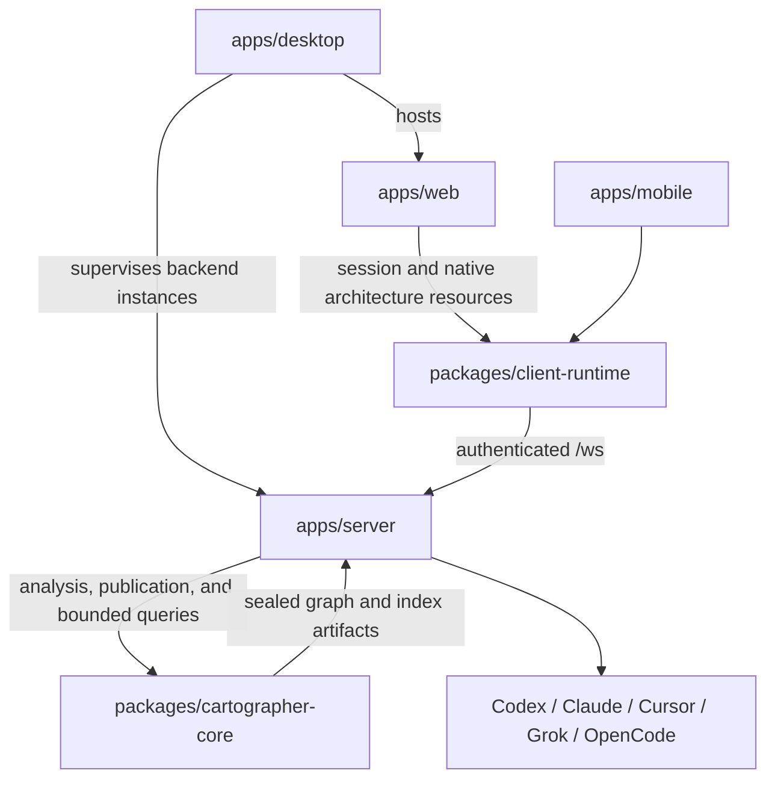
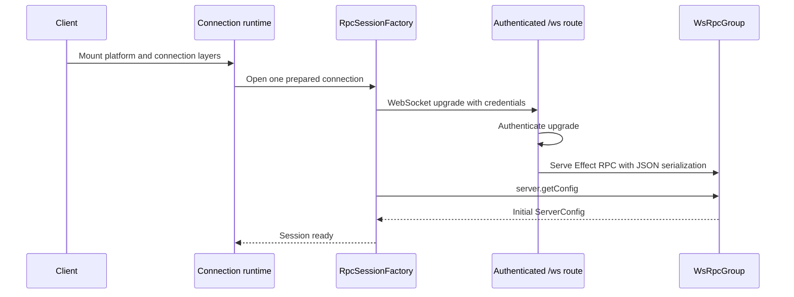
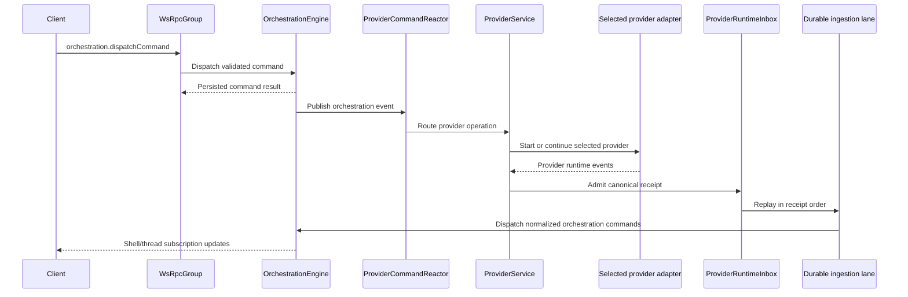
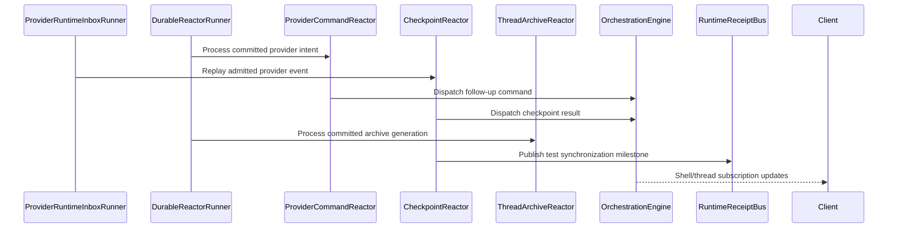

<!-- docs/architecture/overview.md -->
<!-- describes the four-app topology and durable orchestration flow -->

# Architecture

456code is a four-application monorepo: a Node.js HTTP/WebSocket server, React web client, Expo
mobile client, and Electron desktop host. The server routes agent work across the built-in Codex,
Claude, Cursor, Grok, and OpenCode providers. It also turns Cartographer's repository-analysis
artifacts into authorized, bounded projections for native web resources.

## Components

- **Web and mobile clients**: Web and mobile mount the shared connection runtime. The runtime owns
  endpoint preparation, authentication, WebSocket Effect RPC sessions, and retries; application
  components consume environment-scoped services and state.

- **Desktop host**: `apps/desktop` is an Electron lifecycle owner, not another server
  implementation. It supervises a primary 456code backend and optional WSL backends, waits for
  readiness, loads the shared web client, exposes narrow native IPC, and shuts every owned backend
  down before quit or relaunch. See [Desktop Lifecycle](./desktop.md).

- **Server**: `apps/server` serves the web app and exposes the authenticated `/ws` route. The route
  serves the shared [`WsRpcGroup`][1] with JSON serialization after authenticating the WebSocket
  upgrade.

- **Cartographer architecture analysis**: `packages/cartographer-core` owns repository analysis,
  graph artifacts, bounded query primitives, the standalone CLI, and the MCP runtime. Server
  lifecycle services bind those artifacts to authorized project, proposal, and diff identities.
  The web app renders Proposal Impact, Repository Atlas, and Architecture Scope as ordinary
  456code resources; it never receives filesystem roots or raw artifact paths. See
  [Cartographer architecture analysis](../integrations/cartographer.md).

- **Provider runtime**: [`ProviderService`][4] routes sessions through the provider adapter
  registry. The registered built-in drivers create the Codex, Claude, Cursor, Grok, and OpenCode
  implementations behind that shared service contract.

- **Durable async owners**: ProviderService appends each canonical provider event to the
  `ProviderRuntimeInbox` before downstream publication. Independent ingestion and checkpoint lanes
  replay that inbox with durable cursors and transactional buffer checkpoints. Command, archive,
  deletion, attachment, and analysis effects use the orchestration reactor-delivery store. The
  composed reactor facade exposes deterministic drain/shutdown boundaries.

- **Runtime receipts**: [`RuntimeReceiptBus`][8] defines checkpoint and turn-quiescence milestones
  for tests and harnesses. The production layer intentionally does not retain or broadcast these
  receipts.

- **Server updates**: A connected environment advertises whether its server can replace itself.
  When client and server versions differ, the browser selects an automatic, desktop-managed, or
  manual update path without changing connection ownership. See
  [Server Update Architecture](./server-updates.md).

## Event Lifecycle

### Startup and client connect

1. Web, the desktop-hosted web renderer, and mobile mount the shared connection layer at the
   application root.
2. The connection runtime prepares an endpoint and asks [`RpcSessionFactory`][2] for one session.
3. The server's [`/ws` route][3] authenticates the WebSocket upgrade before serving RPC calls.
4. Client and server use JSON serialization for the shared [`WsRpcGroup`][1].
5. The session becomes ready after the socket opens and `server.getConfig` succeeds.

### User turn flow

1. A user action becomes an `orchestration.dispatchCommand` Effect RPC call.
2. [`OrchestrationEngine`][6] validates the command, persists its events and command receipt, and
   updates projections.
3. [`ProviderCommandReactor`][7] reacts to provider intent and calls [`ProviderService`][4], which
   selects the configured provider adapter.
4. After receiving and canonicalizing an adapter event, ProviderService appends it to the durable
   provider-runtime inbox before compatibility/observability publication.
5. [`ProviderRuntimeIngestion`][5] replays its independent inbox cursor and converts canonical
   events into deterministic orchestration commands and events. Streaming shell and thread RPCs
   deliver the projected state to connected clients.

### Async completion flow

1. Provider intent, archive, deletion, attachment, and analysis effects consume committed
   orchestration sequences through durable reactor delivery. Runtime ingestion and checkpoint
   processing independently consume the admitted provider-event sequence.
2. The checkpoint lane does not claim sequence `N` until the ingestion cursor has committed
   through `N`; dependency lag therefore spends no action retry attempt. Consumer buffers and
   cursors advance only with durable completion.
3. The composed `OrchestrationReactor` exposes drain and shutdown boundaries. Shutdown fences
   provider admission, drains both inbox lanes through the persisted high-water, drains downstream
   reactors, and then allows ownership handoff.
4. `CheckpointReactor` publishes checkpoint and turn-quiescence milestones to
   [`RuntimeReceiptBus`][8]; only the test layer streams them.
5. User-visible changes are persisted through [`OrchestrationEngine`][6] and delivered through the
   Effect RPC subscription streams.

[1]: ../../packages/contracts/src/rpc.ts
[2]: ../../packages/client-runtime/src/rpc/session.ts
[3]: ../../apps/server/src/ws.ts
[4]: ../../apps/server/src/provider/Layers/ProviderService.ts
[5]: ../../apps/server/src/orchestration/Layers/ProviderRuntimeIngestion.ts
[6]: ../../apps/server/src/orchestration/Layers/OrchestrationEngine.ts
[7]: ../../apps/server/src/orchestration/Layers/ProviderCommandReactor.ts
[8]: ../../apps/server/src/orchestration/Services/RuntimeReceiptBus.ts
[9]: ../../apps/server/src/orchestration/Layers/CheckpointReactor.ts
