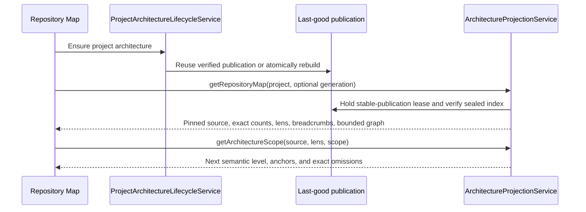

<!-- docs/integrations/cartographer.md -->
<!-- explains native architecture resources, bounded projections, lifecycles, and tools -->

# Cartographer architecture analysis

456code uses Cartographer as its internal architecture-analysis engine. Cartographer builds and
queries repository graphs; 456code owns the product surfaces. **Impact Diff** and **Repository
Map** are ordinary native right-panel resources that use the same authentication, navigation,
composer, source browsing, and WebSocket RPC session as the rest of the web app.

There is no embedded Cartographer application, architecture iframe, authenticated presentation
URL, or separate desktop authentication path. Internal package, RPC, CLI, MCP, and persisted
resource names retain Cartographer and `repository-atlas` terminology as current implementation
identifiers; rendered product copy does not.

## Product and ownership boundary

| Owner                        | Responsibilities                                                                                                                       | Does not own                                                            |
| ---------------------------- | -------------------------------------------------------------------------------------------------------------------------------------- | ----------------------------------------------------------------------- |
| `packages/cartographer-core` | Static analysis, graph and index artifacts, bounded query primitives, diff and patch semantics, CLI, and MCP                           | 456code navigation, tabs, source viewer, theme, or browser presentation |
| `apps/server`                | Target authority, immutable generation identity, standing-project publication, retention, leases, bounded projection RPCs, and cleanup | Client layout or caller-supplied filesystem authority                   |
| `apps/web`                   | Impact Diff, Repository Map, shared graph mechanics, details, focus, source navigation, and local concern context                      | Raw artifact paths, graph recomputation, or lifecycle ownership         |
| `apps/desktop`               | Normal renderer and backend lifecycle                                                                                                  | Architecture-specific request interception or iframe credentials        |

This boundary deliberately preserves the hard correctness machinery while removing the second-IDE
shell. The engine still owns exact graph truth, atomic artifacts, index/query behavior, rule
evaluation, and bounded results. The host owns the task the user is performing.

The native presentation currently belongs to the web client, including the web renderer hosted by
Electron. Mobile architecture presentation remains deferred; the shared client runtime does not
imply that mobile mounts these resources.

## Breaking minimum contract

Native architecture support has one current contract: Planned Impact payloads and projections v1,
`ArchitectureGraphProjection` v1, Atlas Index v6, project metadata v2, and analyze-trees manifest
v2. A manifest-v2 Ready result includes canonical `impact.json`, required
`impact-projection.json`, exact changed-file authority, and immutable source digests.

`architectureImpact` reports analyzer availability; it does not select a protocol version. A
server that advertises it implements the current Impact Projection, Repository Map, Scope, and
immutable source RPCs. Mutable standing caches with an invalid or obsolete index may rebuild.
Immutable old pins, old Ready rows without semantic projection evidence, and obsolete browser
resource identities fail closed instead of being reinterpreted or rebound.

## Native resource model

### Proposal Review

Proposal Review keeps two document-review views:

- **Narrative** renders the optional SafeDocument proposal narrative.
- **Changes** renders the exact normalized source diff for the immutable revision.

A compact authority-aware row reports whether Planned or Verified Impact is pending, no-impact,
changed, unavailable, or failed. A changed result exposes an explicit **Open Impact Diff** action;
a confirmed no-impact result does not offer a graph action. Proposal Review remains mounted and is
never replaced by Impact Diff.

Opening Proposal Review without an immutable revision linked to the selected plan or task shows
that exact absence. It never substitutes a current-worktree capture, another revision, or the most
recent unrelated proposal.

### Impact Diff

Impact Diff answers one immutable proposal or comparison question. It presents one semantic graph
with exact totals and returned/omitted counts. Nodes and edges carry textual state, badge or stroke
treatment, and color so change meaning never depends on color alone. The projection chooses the
narrowest truthful semantic level: systems for cross-system change, blocks for cross-block change,
directories for cross-directory change, or files for a contained local change. A pure
implementation-only result is a direct **No impact** state, not a fabricated graph.

Planned and Verified are independent product authorities:

- **Planned** is the provider's bounded proposal interpretation. It can be provisional before a
  standing map exists and is never described as analyzer evidence.
- **Verified** is sealed exact analyzer evidence from one proposal generation or Diff analysis.
- when both exist, Verified opens by default even when stale; a compact authority switch selects
  either immutable resource without comparing prediction to result.

An open resource stays pinned. A new proposal revision, Verified retry, or provisional-to-anchored
Planned materialization appears as an explicit newer immutable version. The user chooses whether to
open it. Selecting a node or edge opens one shared details drawer (a narrow sheet below the measured
width threshold) with bounded evidence, exact source or planned-path actions, nearest Repository
Map navigation, and **Add concern to composer**. The concern chip remains local until the user
sends the draft.

Proposal generations and completed Diff analyses use the same canvas and presenter. Immutable
Verified source actions read the retained Git side rather than current workspace bytes. A changed
Diff source leaves its prior result visibly stale until the user explicitly re-analyzes.

### Repository Map

Repository Map is a project-and-generation resource backed by the sealed standing index. It opens
without parsing the full graph and provides two peer lenses over the same stable identities:

- **Architecture** drills systems -> blocks -> files.
- **Structure** drills root directories -> nested directories -> files.

Response-provided breadcrumbs, exact totals, bounded omissions, curved weighted edges, minimap,
pan/zoom/fit/reset controls, and one details drawer are shared with Impact Diff. Selection moves
between lenses only through exact file identity or a server-provided dominant crosswalk. Ties remain
explicitly ambiguous. Atlas Index v6 is required. An obsolete immutable index is unavailable;
normal standing-map preparation may rebuild a mutable cache as a new current generation.

The main experience shows only compact generation/freshness state and actionable build or retry
errors. Health data remains sealed for engine and diagnostic consumers but is not dashboard chrome.
An open map stays pinned. A newer last-good generation appears as **Open newer map**, including when
the old generation can no longer be loaded; the client never silently rebinds.

Impact selections navigate to standing context through exact anchors: file membership, longest
directory prefix, then system/block membership. Matched anchors focus one candidate, ambiguous
anchors highlight all candidates, and unmatched anchors open the nearest existing parent/root with
an honest absence banner. Stale anchors retain their original generation when available.

### Interaction and accessibility

The mechanism-only `ArchitectureGraphCanvas` owns camera, geometry, minimap, pan/zoom/reset/fit,
curved edges, hit targets, and roving keyboard focus. Map and Impact keep separate adapters and
presenters; the canvas receives no authority, query, lens, drawer, or source policy. Selection is
keyboard reachable, state has non-color signals, closing details preserves graph selection and
returns focus to a connected trigger, and narrow sheets contain the same actions as wide drawers.

## Runtime and data flow

### Proposal or Diff comparison

```mermaid
sequenceDiagram
    participant Analysis as Proposal or Diff analysis
    participant Artifacts as Sealed artifacts
    participant Projection as ArchitectureQueryService
    participant Web as Native Impact Diff

    Analysis->>Artifacts: Seal raw impact plus impact-projection.json
    Web->>Projection: getArchitectureImpactProjection(exact target)
    Projection->>Artifacts: Verify authority, tree identities, digests, and strict codec
    Projection-->>Web: Exact totals, bounded semantic graph, anchors, source selectors
    Web->>Web: Render Impact Diff; open details, source, map, or local concern on demand
```

The raw `impact.json` remains available to engine and MCP consumers. New proposal and Diff writes
also seal `impact-projection.json` while base/head atlas membership is in memory. Ready reads serve
that bounded artifact without loading or re-diffing full graphs. Historical Ready rows without the
semantic projection remain stored but are unreadable; an admitted retry creates a new generation.
Corrupt, incomplete, pending, or identity-mismatched evidence fails closed.

Verified evidence paths retain bounded side-qualified base/head references. The drawer can
therefore open both immutable sides of a same-path change and the distinct old/new sides of a move
without guessing from labels or reading current workspace bytes.

### Standing repository exploration



The project lifecycle is headless. It owns canonical-root binding, generation epochs, single-flight
rebuilds, last-good publication, invalidation, status retention, and project-deletion cleanup. It
does not manufacture a browser URL.

## Projection contracts and authority

The native data boundary is intentionally explicit rather than a general graph query language.

| RPC                                            | Purpose                                           | Required identity                                         |
| ---------------------------------------------- | ------------------------------------------------- | --------------------------------------------------------- |
| `cartographer.getArchitectureImpactProjection` | Resolve a plan/comparison or read an exact result | Authorized exact plan/comparison descriptor and authority |
| `cartographer.getRepositoryMap`                | Architecture/Structure root or anchor focus       | Authorized task, project, generation, and lens            |
| `cartographer.getArchitectureScope`            | Response-driven semantic drill-down               | Exact standing source, lens, and scope identity           |
| `cartographer.getArchitectureSource`           | Immutable UTF-8 Verified source text              | Exact proposal/diff source, legal side, digest, and path  |

The headless control plane separately exposes project ensure, explicit rebuild, and a project
status stream. Status carries lifecycle state, the exact ready source when one exists, freshness,
and the last build error; it carries no context ID or presentation URL.

Every handler derives environment, task, project, and workspace authority from the authenticated
session. Browser callers never supply a trusted repository root, artifact directory, graph path, or
Git object outside the typed source identity.

Source identities are injective and digest-bound:

- proposal source = task + generation + base/proposed side + graph digest;
- Diff source = task + Diff analysis + base/head side + graph digest; and
- standing source = project + publication generation + analyzed side + graph digest.

Standing-project files intentionally open through the current workspace Files surface. Immutable
proposal and Diff source reads use the retained Git tree directly, cap text at 2 MiB, reject binary
or invalid UTF-8 content, and never fall through to current workspace bytes.

### Exactness and payload bounds

Shared graph counts carry authoritative `total`, `returned`, and explicit `omitted` values. The
schema checks that returned arrays and cross-references match those counts. Hero projections return
at most 60 nodes and 120 edges while retaining exact totals; evidence and anchors have independent
bounds. Source reads remain capped at 2 MiB. A map/scope read holds a stable-publication lease and
verifies generation plus graph digest before returning data.

These bounds are presentation and transport limits, not analyzer shortcuts. Cartographer's complete
artifacts remain available to the server, CLI, MCP tools, and other authorized engine operations.

### Performance contract

| Interaction                  | Data path                                                         | Work forbidden on the read path                                                   |
| ---------------------------- | ----------------------------------------------------------------- | --------------------------------------------------------------------------------- |
| Ready Planned Impact         | Immutable stored publication/projection revision                  | Provider rerun, standing-map rebind, or mutation of an open provisional resource  |
| Ready Verified Impact        | Strict sealed `impact-projection.json`                            | Full base/head graph reads, re-diff, index build, SQLite write, or worker startup |
| Repository Map               | Hash-bound sealed standing index under a stable-publication lease | Full `graph.json` parse or presentation-model initialization                      |
| Architecture/Structure scope | Bounded semantic projection from the same sealed index            | Unbounded descendants or implicit full-detail expansion                           |

Server metrics separately record architecture generation, projection reads, and index reads so
analysis cost is not conflated with the time to reopen an already-ready native resource.

## Analysis targets and lifecycle

456code retains five architecture target families without retaining browser contexts.

| Target                    | Ownership and recovery                                                                                                                                                                                                   |
| ------------------------- | ------------------------------------------------------------------------------------------------------------------------------------------------------------------------------------------------------------------------ |
| **Current task worktree** | One exact on-demand capture owned by a task. It is not a watcher. Reads hold a lease, replacement closes the previous target, idle targets expire after eight hours, and task deletion closes the target.                |
| **Proposal generation**   | One immutable base/proposed pair owned by its source task and proposal revision. A newer request supersedes active work; restart abandons in-flight rows; a ready retained generation reopens without recomputation.     |
| **Standing project**      | One canonical project binding and last-good publication. Ensure reuses verified metadata or rebuilds; root changes invalidate the binding; project deletion removes its artifacts through the durable lifecycle reactor. |
| **Diff analysis**         | One exact checkpoint/review/Git-tree pair with durable ready-result retention. A retained row reopens by identity; a pruned or source-stale row requires **Re-analyze**.                                                 |
| **Planned publication**   | Immutable provider claims and separately materialized graph revisions keyed by task, plan, publication revision, and digest. Provisional and anchored revisions never overwrite one another.                             |

Standing rebuilds are single-flight per project and serialized through publication ownership. Each
build writes and verifies staging output before atomic publication. A failure preserves the prior
good generation and reports the build error separately from the last-good source. Project status is
retained only while native consumers need it; completed turns and Cartographer authoring-file
changes can suggest a debounced rebuild for retained projects.

Server-owned worktree and standing-project builds pass `--no-history`, so native publication keeps
only `graph.json` and the sealed `atlas-index.json`. Normal CLI `build` continues recording bounded
`graph.db` snapshot history for the `snapshots`, `diff --base`, and MCP flows. The retired browser's
machine-wide project registry is no longer written.

Proposal generation and Diff analysis keep their independent concurrency, retention, and cleanup
policies. Proposal rows use a 24-hour retention grace around terminal work. Failed, cancelled, and
restart-abandoned Diff rows remain briefly observable; ready Diff rows use the configured
per-repository and global LRU budgets. Active reads retain their exact target while the scoped query
is running.

Proposal-revision admission is server-owned. The transaction that commits an immutable proposal
also creates a unique durable admission. Lease-based workers reuse normal generation single-flight
and cache behavior, classify retries, and recover pending work after restart. Clients poll state and
offer explicit retry; mounting or remounting a card never starts duplicate automatic analysis.

## Planned Impact authority

An authenticated provider with `architecture` and `proposal` capabilities may call
`architecture_plan_impact_upsert` during an active Plan turn or against the exact tool-sourced
Orchestrate revision. The server derives environment, project, task, turn, provider, filesystem,
plan, and Repository Map authority. Arguments cannot supply trusted project IDs, graph or
generation IDs, filesystem roots, digests, or standing semantic IDs.

The bounded publication accepts a summary, explicit `changed` or `no-impact` outcome, up to 60
changed objects, 120 relationships, 100 repository-relative path hints, rationale, and omission
metadata. Canonical payload size is capped at 256 KiB. Endpoints use publication-local IDs only.
Identical retries are idempotent; changed content appends and supersedes an immutable revision.

The write transaction stores provider claims separately from materialized projections and creates a
provisional namespaced graph immediately. If no Repository Map is ready, durable admission starts or
reuses the normal standing build. Once its exact V6 index is ready, the server appends an anchored
projection with persisted matched/ambiguous/unmatched resolutions and collision-safe standing IDs.
An already-open provisional resource remains pinned and offers the anchored revision explicitly.
Reverted plans leave active lookup while exact pinned Planned and Verified resources remain
historical read-only.

## Proposal preview authority

In a plan-mode task, provider guidance asks a decision-complete agent to publish Planned Impact
first, then call the task-scoped `proposal_preview_upsert` tool when concrete file operations exist,
and finally emit the plan. The preview tool accepts bounded typed file operations and optional
SafeDocument MDX. It does not accept environment, project, task, provider session, worktree root,
or plan authority from tool arguments. The immutable proposal revision pins the exact Planned
publication when both exist.

The server:

1. verifies that the authenticated provider session, live turn, projected turn, and interaction
   mode identify the same active plan-mode turn;
2. derives the future plan identity from that task and turn;
3. captures current Git bytes with object plumbing and an isolated temporary index, without clean,
   smudge, EOL, text-conversion, or checkout filters;
4. validates every proposed operation against captured bytes and modes;
5. writes a new immutable revision, content-addressed blobs, and exact retained Git trees.

Calls outside that live authority fail closed. The guidance is not a server-side prerequisite for
ingesting a final plan item, so a provider can still produce an explicitly unlinked plan. 456code
does not guess a replacement proposal.

When implementation starts from a linked plan, 456code stores the selected proposal revision, its
timestamp, and exact baseline tree in the implementation attempt. Checkpoint completion compares
baseline to actual and reports **matched**, **partial**, or **divergent**. A desired state that
already existed before the implementation turn is not counted as work performed by that turn.

## Diff analysis modes

**Settings > Source Control > Architecture analysis** provides **Off**, **On demand**, and
**Automatic**. On demand is the default. Off and On demand disable only the automatic reactor;
manual analysis remains available.

Automatic mode reacts to a ready turn checkpoint and requests the exact pair
`max(0, n - 1) -> n` through the same cache and concurrency controls as manual analysis. It does not
analyze mutable `HEAD`, backfill events from before reactor installation, or silently switch target
identity. Deleted tasks, superseded checkpoints, missing refs, and unsupported sources are terminal
skips; transient infrastructure failures follow durable reactor retry policy.

## Agent architecture tools

An authenticated MCP session with the `architecture` capability exposes four bounded tools:

- `architecture_blast_radius` reads upstream/downstream impact for a file or `file#export` from an
  already-analyzed current-worktree, standing, proposal, or Diff target.
- `architecture_graph_diff` compares the paired graphs from one completed proposal generation or
  Diff analysis; it cannot address arbitrary graph pairs.
- `architecture_propose_patch` evaluates a bounded GraphPatch v1 operation list during an active
  turn. It is ephemeral and never edits the worktree or writes a Proposal record.
- `architecture_plan_impact_upsert` publishes bounded Planned Impact during an authenticated active
  Plan or exact Orchestrate revision; it never accepts standing IDs or claims Verified authority.

The read/evaluation tools derive all authority from the MCP session, return typed recovery guidance
when a target is not ready, and never start or refresh analysis. Planned publication intentionally
creates durable materialization admission. List results expose returned, total, and omitted counts.
The patch tool accepts at most 2,000 operations and 1 MiB of canonical input and caps evaluation
work.

## CLI, MCP, and packaging

`@t3tools/cartographer-core` remains a private workspace package bundled into the published
`456code` archive with its required production closure. It retains the analysis/query engine,
standalone CLI binary, and stdio MCP binary:

```bash
node packages/cartographer-core/dist/cli/index.js --help
node packages/cartographer-core/dist/mcp/bin.js
```

The release gate installs the exact packed archive in clean npm and pnpm consumers, rejects local
workspace dependency references, imports the server facade, exercises the installed CLI and MCP
entry points, starts the installed server, and publishes that same validated archive.

The environment advertises `architectureImpact` when the current analyzer and RPC contract is
available. There is no older-server architecture adapter. Right-panel storage preserves current
exact Impact descriptors, current standing Repository Map resources, immutable architecture source
files, and unrelated tabs; it drops comparison-bound raw Impact and standalone Scope resources.
A missing analyzer disables architecture controls without making the rest of the server fail to
start.

### Breaking browser-surface removal

The Cartographer `serve` and `embed-server` commands, browser export, static web bundle, and hosted
Atlas HTTP surface were removed intentionally. This is a breaking change for callers that used the
Cartographer browser workbench. There is no compatibility redirect or placeholder server: use the
native 456code resources for interactive exploration and the retained CLI/MCP/query engine for
automation.

The retirement also removes the duplicate project switcher and file explorer, global mode rail and
Insights feed, writable proposal/source overlays, theme/settings and manual arrangement state, and
the browser model worker. The required comparison, coarse map, dependency, health, and source tasks
now have the native destinations documented above.

This removal does not change graph analysis semantics, GraphPatch semantics, the stdio MCP binary,
or the supported non-browser CLI commands.

## Build the 456code self-architecture

The root `.cartographer.json` describes the monorepo. After building
`@t3tools/cartographer-core`, generate a disposable analysis from the repository root:

```bash
node packages/cartographer-core/dist/cli/index.js build . --scope . --out /tmp/456code-architecture --no-history
```

Run `node scripts/smoke-dogfood-architecture.ts` to build the same analysis in a temporary
directory and verify its configured systems, dependency rules, journey, runtime entry points, path
headers, and source-only scope.

To omit generated or repository-specific trees, add literal path segments to the root
`.cartographer.json` `exclude` array. Separators, `.` and `..` are rejected, and exclusions match
whole path segments under the analyzed scope.

## Exact Git and trust boundary

The first-party capture path is deliberately Git-only:

- tracked files use current filesystem bytes; untracked and unignored files are included;
- ignored files are omitted and the staging boundary is not preserved;
- clean, smudge, EOL, text-conversion, and checkout filters are not run;
- proposal operations target regular non-symlink file modes; existing captured symlinks are not
  followed by static analysis; and
- dirty submodules, non-Git workspaces, and cross-worktree proposals fail explicitly.

Disposable materialization writes retained Git blob bytes and modes directly. The static analyzer
does not execute project code. It runs with the server operator's process privileges, so verified
roots, digests, size limits, and no-follow checks remain security boundaries even though the old
iframe containment boundary no longer exists.

Proposal input is bounded to 200 operations, 2 MiB per file, 10 MiB of submitted content, 10 MiB of
unified-diff input, 20 MiB of normalized diff output, and 1 MiB of narrative MDX. Exact proposal,
current-worktree, and analysis snapshots accept at most 25,000 entries or 256 MiB. Cartographer
enforces a combined 128 MiB limit before publishing proposal graph and impact artifacts.

All native architecture traffic uses the authenticated Effect RPC session and its normal
authorization scopes. No client receives an architecture bearer token, presentation URL, or
filesystem root. SafeDocument remains the only proposal narrative renderer; executable authored
content is not enabled by architecture analysis.

## Troubleshooting

### Native resources

- **Architecture is unavailable**: build `@t3tools/cartographer-core` and the server, then verify
  the environment advertises `architectureImpact`.
- **Proposal Review has no Impact row**: select an immutable proposal revision linked to the exact
  plan/task. Current worktree state and another proposal revision are not fallbacks.
- **Impact Diff is stale or unavailable**: keep reading the pinned exact resource, explicitly open
  its newer version, or choose **Re-analyze** for a changed/pruned Diff target. An old Ready row
  without semantic projection evidence requires a current admitted retry.
- **Repository Map rebuild failed**: correct the project or Cartographer authoring error and
  rebuild. The prior verified publication remains available.
- **A Map anchor or source was rejected**: reopen from the authoritative parent resource. A stale
  generation, wrong side, digest mismatch, invalid scope, or cross-task identity fails closed.

### Automation and distribution

- **Automatic analysis did not run**: confirm the setting is Automatic and that a ready checkpoint
  pair exists. Automatic mode does not backfill older turns.
- **An architecture tool reports not ready**: perform the typed recovery action and repeat the
  query. The tool does not trigger analysis itself.
- **CLI analysis fails to start**: use a Node.js version supported by
  `@t3tools/cartographer-core`, rebuild the package, and verify the selected repository is Git.
- **`serve` or `embed-server` is unknown**: those browser commands were removed intentionally; use
  456code's native resources or a retained non-browser CLI/MCP command.
