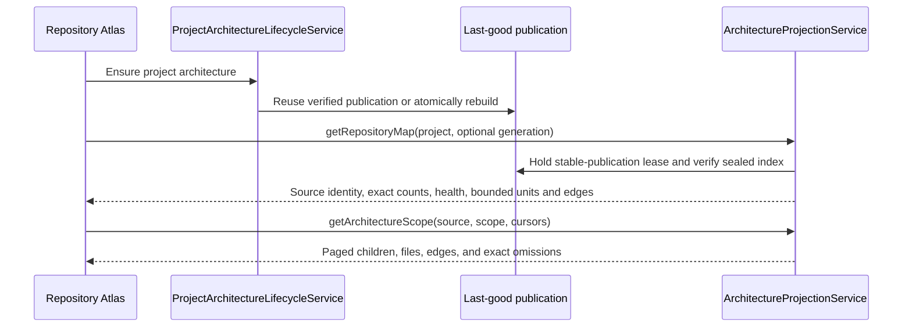

<!-- docs/integrations/cartographer.md -->
<!-- explains native architecture resources, bounded projections, lifecycles, and tools -->

# Cartographer architecture analysis

456code uses Cartographer as an architecture-analysis engine. Cartographer builds and queries
repository graphs; 456code owns the user interface. Proposal Impact, Repository Atlas, and
Architecture Scope are ordinary native right-panel resources that use the same components,
navigation, authentication, and WebSocket RPC session as the rest of the web app.

There is no embedded Cartographer application, architecture iframe, authenticated presentation
context URL, or separate desktop authentication path. **Repository Atlas** is the product name for
the native coarse repository map, not a browser SPA.

## Product and ownership boundary

| Owner                        | Responsibilities                                                                                                                       | Does not own                                                            |
| ---------------------------- | -------------------------------------------------------------------------------------------------------------------------------------- | ----------------------------------------------------------------------- |
| `packages/cartographer-core` | Static analysis, graph and index artifacts, bounded query primitives, diff and patch semantics, CLI, and MCP                           | 456code navigation, tabs, source viewer, theme, or browser presentation |
| `apps/server`                | Target authority, immutable generation identity, standing-project publication, retention, leases, bounded projection RPCs, and cleanup | Client layout or caller-supplied filesystem authority                   |
| `apps/web`                   | Proposal Impact, Impact Diff, Repository Atlas, Architecture Scope, Graph/List presentation, details, focus, and source navigation     | Raw artifact paths, graph recomputation, or lifecycle ownership         |
| `apps/desktop`               | Normal renderer and backend lifecycle                                                                                                  | Architecture-specific request interception or iframe credentials        |

This boundary deliberately preserves the hard correctness machinery while removing the second-IDE
shell. The engine still owns exact graph truth, atomic artifacts, index/query behavior, rule
evaluation, and bounded results. The host owns the task the user is performing.

The native presentation currently belongs to the web client, including the web renderer hosted by
Electron. Mobile architecture presentation remains deferred; the shared client runtime does not
imply that mobile mounts these resources.

## Native resource model

### Proposal Review

Proposal Review keeps two document-review views:

- **Narrative** renders the optional SafeDocument proposal narrative.
- **Changes** renders the exact normalized source diff for the immutable revision.

A compact architecture row reports whether analysis is pending, unchanged, changed, unavailable,
or failed. When a comparison is ready, opening that row creates or reactivates a separate
generation-bound **Impact Diff** resource. Proposal Review never replaces itself with an
architecture workbench.

Opening Proposal Review without an immutable revision linked to the selected plan or task shows
that exact absence. It never substitutes a current-worktree capture, another revision, or the most
recent unrelated proposal.

### Impact Diff

Impact Diff answers one immutable comparison question. It provides:

- **Before / Diff / After** controls within the same comparison;
- **Graph / List** renderers over the same bounded evidence;
- exact summary totals, freshness and identity metadata, and explicit omission counts;
- one contextual details drawer, or a modal sheet at narrow widths; and
- generation- and side-bound source actions for returned proposal or diff files.

The default Diff view contains change evidence only. It does not load unchanged repository
neighborhoods to make a tiny proposal look like an entire repository map. Selecting a node or edge
shows its returned evidence; opening immutable source reads the exact retained Git side rather than
the live workspace.

Proposal generations and completed Diff analyses use the same presentation. A Diff source remains
tied to its exact checkpoint, review, or Git-tree identity. When the selected Diff source changes,
the previous result remains visibly stale until the user chooses **Re-analyze**.

### Repository Atlas

Repository Atlas is a project-and-generation resource backed by the sealed standing-project index.
It opens to a useful coarse map without parsing the full graph or starting a presentation worker.
The resource shows:

- exact repository file, import, system, and block counts;
- compact cycle, orphan, violating-import, and violated-rule health totals;
- a bounded systems or blocks dependency map with a Graph/List alternative; and
- generation, build time, Git reference, dirty-snapshot, and authored-versus-inferred status.

Selecting a system or block opens one details surface with its file, incoming, and outgoing counts.
The explicit **Open system** or **Open block** action creates or reuses an Architecture Scope
resource. An open Repository Atlas stays pinned to its generation. If a newer last-good publication
becomes ready, the UI offers **View updated Atlas** instead of changing the data underneath the
user.

If refresh fails, the pinned last-good map remains visible with an explicit retry. A failed rebuild
does not replace a verified prior publication.

### Architecture Scope

Architecture Scope answers one bounded drill-down question for an exact source:

- a system pages its child blocks, dependencies, and files;
- a block pages its meaningful child directories, dependencies, and files;
- a file neighborhood shows bounded incoming, outgoing, or combined dependencies; and
- a returned file opens either normal workspace Files or an immutable read-only source resource,
  according to its source identity.

Child and file pages use opaque server cursors. Totals are independent from the current page, so a
page cannot be mistaken for the complete scope. Selecting a child or file opens the shared details
drawer; the explicit Open action creates or reuses the corresponding durable resource.

### Interaction and accessibility

Graph and List are two presentations of the same bounded response. Selection is keyboard
reachable, Enter performs the explicit Open action where one exists, and closing details restores
focus to the trigger. Wide resources use a non-modal drawer; narrow resources use a modal sheet
with the same content and focus-return contract. Visual position and color never add authority that
is absent from the decoded response.

## Runtime and data flow

### Proposal or Diff comparison

```mermaid
sequenceDiagram
    participant Analysis as Proposal or Diff analysis
    participant Artifacts as Sealed artifacts
    participant Projection as ArchitectureProjectionService
    participant Web as Native Impact Diff

    Analysis->>Artifacts: Publish graphs plus versioned bounded impact
    Web->>Projection: getArchitectureImpact(exact comparison identity)
    Projection->>Artifacts: Verify authority, identity, digest, and strict codec
    Projection-->>Web: Exact totals plus bounded witnesses and source selectors
    Web->>Web: Render Diff by default; open details or exact source on demand
```

New versioned impact artifacts are read directly. Reopening a ready comparison does not create a
presentation context, parse both full graphs, initialize an index, write SQLite, or start a worker.
Only an older retained unversioned impact artifact may use the compatibility graph-diff fallback;
new corrupt or identity-mismatched artifacts fail closed.

### Standing repository exploration



The project lifecycle is headless. It owns canonical-root binding, generation epochs, single-flight
rebuilds, last-good publication, invalidation, status retention, and project-deletion cleanup. It
does not manufacture a browser URL.

## Projection contracts and authority

The native data boundary is intentionally explicit rather than a general graph query language.

| RPC                                        | Purpose                                     | Required identity                                        |
| ------------------------------------------ | ------------------------------------------- | -------------------------------------------------------- |
| `cartographer.getArchitectureImpact`       | Exact proposal or Diff comparison           | Authorized generation or Diff analysis selector          |
| `cartographer.getRepositoryMap`            | Coarse systems/blocks map and health        | Authorized task, project, and optional exact generation  |
| `cartographer.getArchitectureScope`        | Paged children, files, and edges            | Exact standing-project source plus system/block scope    |
| `cartographer.getArchitectureNeighborhood` | Bounded incoming/outgoing file dependencies | Exact standing, proposal-side, or diff-side source       |
| `cartographer.getArchitectureSource`       | Immutable UTF-8 source text                 | Exact proposal/diff source, legal side, digest, and path |

The headless control plane separately exposes project ensure, explicit rebuild, and a project
status stream. Status carries lifecycle state, the exact ready source when one exists, freshness,
and the last build error; it carries no context ID or presentation URL.

Every handler derives environment, task, project, and workspace authority from the authenticated
session. Browser callers never supply a trusted repository root, artifact directory, graph path, or
Git object outside the typed source identity.

Source identities are injective and digest-bound:

- proposal source = task + generation + base/proposed side + graph digest;
- Diff source = task + Diff analysis + base/head side + graph digest; and
- standing source = project + publication generation + analyzed side + graph digest.

Standing-project files intentionally open through the current workspace Files surface. Immutable
proposal and Diff source reads use the retained Git tree directly, cap text at 2 MiB, reject binary
or invalid UTF-8 content, and never fall through to current workspace bytes.

### Exactness and payload bounds

Projection counts separate four concepts: authoritative `total`, represented `indexed`, returned
on this response or page, and explicitly `omitted`. The invariant is checked by the shared schema;
the UI does not infer safety from the length of a witness array.

Native projection responses are bounded to 200 units, 400 edges, and 100 files per response. Source
reads are bounded to 2 MiB. Repository health totals and per-parent child/edge totals are sealed in
the persisted index before truncation. A native map or scope read holds a stable-publication lease
and verifies the index identity, including its generation and graph digest, before returning data.

These bounds are presentation and transport limits, not analyzer shortcuts. Cartographer's complete
artifacts remain available to the server, CLI, MCP tools, and other authorized engine operations.

### Performance contract

| Interaction                   | Data path                                                         | Work forbidden on the read path                                                                    |
| ----------------------------- | ----------------------------------------------------------------- | -------------------------------------------------------------------------------------------------- |
| Ready Proposal or Diff Impact | Strict sealed impact artifact                                     | Full base/head graph reads, re-diff, index build, context binding, SQLite write, or worker startup |
| Repository Atlas              | Hash-bound sealed standing index under a stable-publication lease | Full `graph.json` parse or presentation-model initialization                                       |
| System/block Scope            | Cursor-bounded parent projection from the same sealed index       | Unbounded descendants or implicit full-detail expansion                                            |
| File neighborhood             | Explicit bounded graph query for one selected path                | Automatic repository-wide expansion                                                                |

Server metrics separately record architecture generation, projection reads, and index reads so
analysis cost is not conflated with the time to reopen an already-ready native resource.

## Analysis targets and lifecycle

456code retains four analysis target families without retaining browser contexts.

| Target                    | Ownership and recovery                                                                                                                                                                                                   |
| ------------------------- | ------------------------------------------------------------------------------------------------------------------------------------------------------------------------------------------------------------------------ |
| **Current task worktree** | One exact on-demand capture owned by a task. It is not a watcher. Reads hold a lease, replacement closes the previous target, idle targets expire after eight hours, and task deletion closes the target.                |
| **Proposal generation**   | One immutable base/proposed pair owned by its source task and proposal revision. A newer request supersedes active work; restart abandons in-flight rows; a ready retained generation reopens without recomputation.     |
| **Standing project**      | One canonical project binding and last-good publication. Ensure reuses verified metadata or rebuilds; root changes invalidate the binding; project deletion removes its artifacts through the durable lifecycle reactor. |
| **Diff analysis**         | One exact checkpoint/review/Git-tree pair with durable ready-result retention. A retained row reopens by identity; a pruned or source-stale row requires **Re-analyze**.                                                 |

Standing rebuilds are single-flight per project and serialized through publication ownership. Each
build writes and verifies staging output before atomic publication. A failure preserves the prior
good generation and reports the build error separately from the last-good source. Project status is
retained only while native consumers need it; completed turns and Cartographer authoring-file
changes can suggest a debounced rebuild for retained projects.

Server-owned worktree and standing-project builds pass `--no-history`, so native publication keeps
only `graph.json` and the sealed `atlas-index.json`. Normal CLI `build` continues recording bounded
`graph.db` snapshot history for the `snapshots`, `diff --base`, and MCP flows. The retired browser's
machine-wide project registry is no longer written.

Proposal generation and Diff analysis keep their independent concurrency, retention, and cleanup
policies. Proposal rows use a 24-hour retention grace around terminal work. Failed, cancelled, and
restart-abandoned Diff rows remain briefly observable; ready Diff rows use the configured
per-repository and global LRU budgets. Active reads retain their exact target while the scoped query
is running.

## Proposal preview authority

In a plan-mode task, provider guidance requires a decision-complete agent to call the task-scoped
`proposal_preview_upsert` tool before emitting its final plan. The tool accepts bounded typed file
operations and optional SafeDocument MDX. It does not accept environment, project, task, provider
session, worktree root, or plan authority from tool arguments.

The server:

1. verifies that the authenticated provider session, live turn, projected turn, and interaction
   mode identify the same active plan-mode turn;
2. derives the future plan identity from that task and turn;
3. captures current Git bytes with object plumbing and an isolated temporary index, without clean,
   smudge, EOL, text-conversion, or checkout filters;
4. validates every proposed operation against captured bytes and modes;
5. writes a new immutable revision, content-addressed blobs, and exact retained Git trees.

Calls outside that live authority fail closed. The guidance is not a server-side prerequisite for
ingesting a final plan item, so a provider can still produce an explicitly unlinked plan. 456code
does not guess a replacement proposal.

When implementation starts from a linked plan, 456code stores the selected proposal revision, its
timestamp, and exact baseline tree in the implementation attempt. Checkpoint completion compares
baseline to actual and reports **matched**, **partial**, or **divergent**. A desired state that
already existed before the implementation turn is not counted as work performed by that turn.

## Diff analysis modes

**Settings > Source Control > Architecture analysis** provides **Off**, **On demand**, and
**Automatic**. On demand is the default. Off and On demand disable only the automatic reactor;
manual analysis remains available.

Automatic mode reacts to a ready turn checkpoint and requests the exact pair
`max(0, n - 1) -> n` through the same cache and concurrency controls as manual analysis. It does not
analyze mutable `HEAD`, backfill events from before reactor installation, or silently switch target
identity. Deleted tasks, superseded checkpoints, missing refs, and unsupported sources are terminal
skips; transient infrastructure failures follow durable reactor retry policy.

## Agent architecture tools

An authenticated MCP session with the `architecture` capability exposes three bounded tools:

- `architecture_blast_radius` reads upstream/downstream impact for a file or `file#export` from an
  already-analyzed current-worktree, standing, proposal, or Diff target.
- `architecture_graph_diff` compares the paired graphs from one completed proposal generation or
  Diff analysis; it cannot address arbitrary graph pairs.
- `architecture_propose_patch` evaluates a bounded GraphPatch v1 operation list during an active
  turn. It is ephemeral and never edits the worktree or writes a Proposal record.

The tools derive all authority from the MCP session, return typed recovery guidance when the target
is not ready, and never start or refresh analysis. List results expose returned, total, and omitted
counts. The patch tool accepts at most 2,000 operations and 1 MiB of canonical input and caps its
evaluation work.

## CLI, MCP, and packaging

`@t3tools/cartographer-core` remains a private workspace package bundled into the published
`456code` archive with its required production closure. It retains the analysis/query engine,
standalone CLI binary, and stdio MCP binary:

```bash
node packages/cartographer-core/dist/cli/index.js --help
node packages/cartographer-core/dist/mcp/bin.js
```

The release gate installs the exact packed archive in clean npm and pnpm consumers, rejects local
workspace dependency references, imports the server facade, exercises the installed CLI and MCP
entry points, starts the installed server, and publishes that same validated archive.

The environment advertises one `architectureImpact` capability when the analyzer distribution is
available. Proposal, Diff, Repository Atlas, and Scope entry points use that capability; there is no
second browser-Atlas capability. A missing analyzer disables architecture controls without making
the rest of the server fail to start.

### Breaking browser-surface removal

The Cartographer `serve` and `embed-server` commands, browser export, static web bundle, and hosted
Atlas HTTP surface were removed intentionally. This is a breaking change for callers that used the
Cartographer browser workbench. There is no compatibility redirect or placeholder server: use the
native 456code resources for interactive exploration and the retained CLI/MCP/query engine for
automation.

The retirement also removes the duplicate project switcher and file explorer, global mode rail and
Insights feed, writable proposal/source overlays, theme/settings and manual arrangement state, and
the browser model worker. The required comparison, coarse map, dependency, health, and source tasks
now have the native destinations documented above.

This removal does not change graph analysis semantics, GraphPatch semantics, the stdio MCP binary,
or the supported non-browser CLI commands.

## Build the 456code self-architecture

The root `.cartographer.json` describes the monorepo. After building
`@t3tools/cartographer-core`, generate a disposable analysis from the repository root:

```bash
node packages/cartographer-core/dist/cli/index.js build . --scope . --out /tmp/456code-architecture --no-history
```

Run `node scripts/smoke-dogfood-architecture.ts` to build the same analysis in a temporary
directory and verify its configured systems, dependency rules, journey, runtime entry points, path
headers, and source-only scope.

To omit generated or repository-specific trees, add literal path segments to the root
`.cartographer.json` `exclude` array. Separators, `.` and `..` are rejected, and exclusions match
whole path segments under the analyzed scope.

## Exact Git and trust boundary

The first-party capture path is deliberately Git-only:

- tracked files use current filesystem bytes; untracked and unignored files are included;
- ignored files are omitted and the staging boundary is not preserved;
- clean, smudge, EOL, text-conversion, and checkout filters are not run;
- proposal operations target regular non-symlink file modes; existing captured symlinks are not
  followed by static analysis; and
- dirty submodules, non-Git workspaces, and cross-worktree proposals fail explicitly.

Disposable materialization writes retained Git blob bytes and modes directly. The static analyzer
does not execute project code. It runs with the server operator's process privileges, so verified
roots, digests, size limits, and no-follow checks remain security boundaries even though the old
iframe containment boundary no longer exists.

Proposal input is bounded to 200 operations, 2 MiB per file, 10 MiB of submitted content, 10 MiB of
unified-diff input, 20 MiB of normalized diff output, and 1 MiB of narrative MDX. Exact proposal,
current-worktree, and analysis snapshots accept at most 25,000 entries or 256 MiB. Cartographer
enforces a combined 128 MiB limit before publishing proposal graph and impact artifacts.

All native architecture traffic uses the authenticated Effect RPC session and its normal
authorization scopes. No client receives an architecture bearer token, presentation URL, or
filesystem root. SafeDocument remains the only proposal narrative renderer; executable authored
content is not enabled by architecture analysis.

## Troubleshooting

### Native resources

- **Architecture is unavailable**: build `@t3tools/cartographer-core` and the server, then verify
  the environment advertises the `architectureImpact` capability.
- **Proposal Review has no architecture row**: select an immutable proposal revision linked to the
  exact plan/task. Current worktree state is not a fallback.
- **Impact is stale or unavailable**: create a new proposal generation, or choose **Re-analyze** for
  a changed or pruned Diff target. Retry only repeats the read for the same identity.
- **Repository Atlas rebuild failed**: correct the project or Cartographer authoring error and
  rebuild. The prior verified publication remains available.
- **Scope or source was rejected**: reopen from the authoritative parent resource. A stale
  generation, wrong side, digest mismatch, invalid cursor, or cross-task identity fails closed.

### Automation and distribution

- **Automatic analysis did not run**: confirm the setting is Automatic and that a ready checkpoint
  pair exists. Automatic mode does not backfill older turns.
- **An architecture tool reports not ready**: perform the typed recovery action and repeat the
  query. The tool does not trigger analysis itself.
- **CLI analysis fails to start**: use a Node.js version supported by
  `@t3tools/cartographer-core`, rebuild the package, and verify the selected repository is Git.
- **`serve` or `embed-server` is unknown**: those browser commands were removed intentionally; use
  456code's native resources or a retained non-browser CLI/MCP command.
